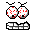



## Killer Button\! \(Jaws? hehe\)

### Description

Don't worry, it doesn't kill your system or anything, it's for those "Yes/No" or "Register Now?" boxes, or just for a laugh!!

If the user clicks "no" (or yes if you swap them) then the other button gets angry and goes after your cursor, with a snarl on its face and eyes that watch you! But don't worry! he's confined to the form.. or is he?
 
### More Info
 
Ermm.. a program to put it in? lol

or it could be standalone of course

How to have a laugh :) and using VB could be useful

A definate 'Yes' to registering, lol!

The engines are a little long at the moment, and on my system there are a few glitches with VB changing images, though i do have a Very slow computer....

             |
---                |---
**Submitted On**   |1999-08-26 19:30:12
**By**             |[GEEZA](https://github.com/Planet-Source-Code/PSCIndex/blob/master/ByAuthor/geeza.md)
**Level**          |Unknown
**User Rating**    |5.0 (35 globes from 7 users)
**Compatibility**  |VB 3\.0, VB 4\.0 \(16\-bit\), VB 4\.0 \(32\-bit\), VB 5\.0, VB 6\.0
**Category**       |[Jokes/ Humor](https://github.com/Planet-Source-Code/PSCIndex/blob/master/ByCategory/jokes-humor__1-40.md)
**World**          |[Visual Basic](https://github.com/Planet-Source-Code/PSCIndex/blob/master/ByWorld/visual-basic.md)
**Archive File**   |[CODE\_UPLOAD643\.zip](https://github.com/Planet-Source-Code/geeza-killer-button-jaws-hehe__1-3260/archive/master.zip)

